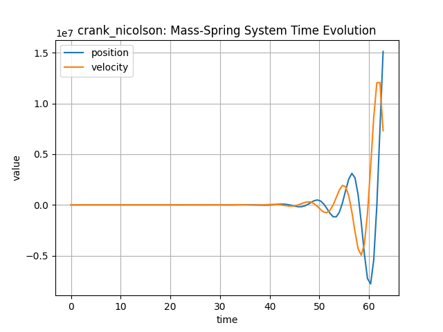
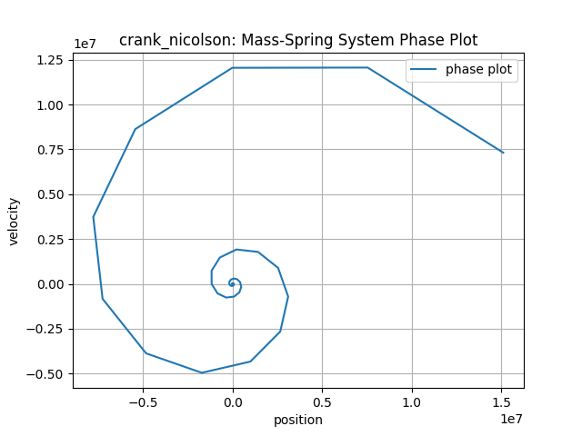
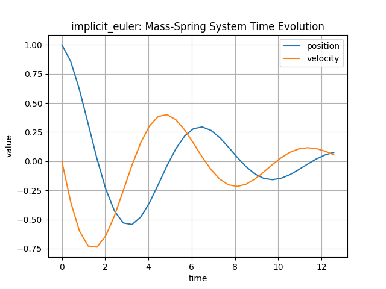
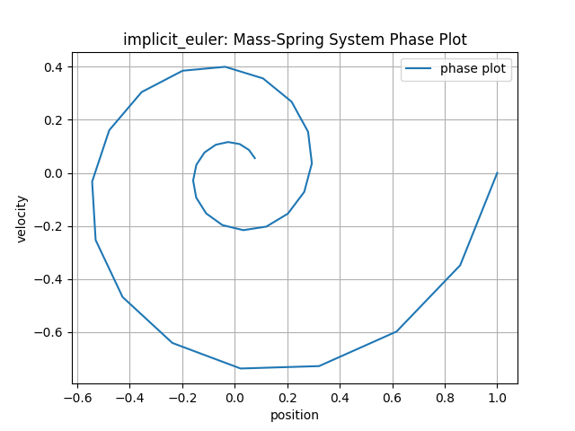
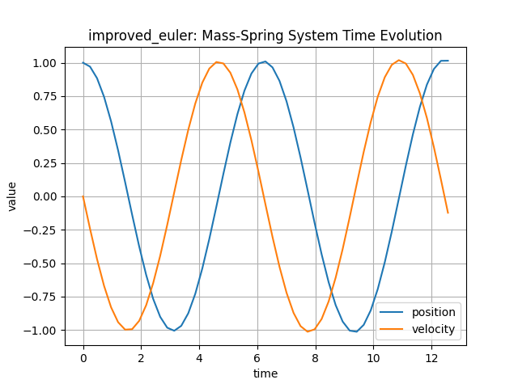
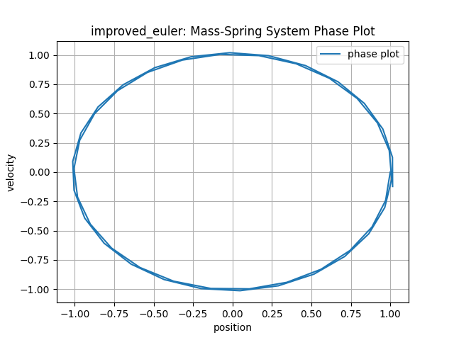
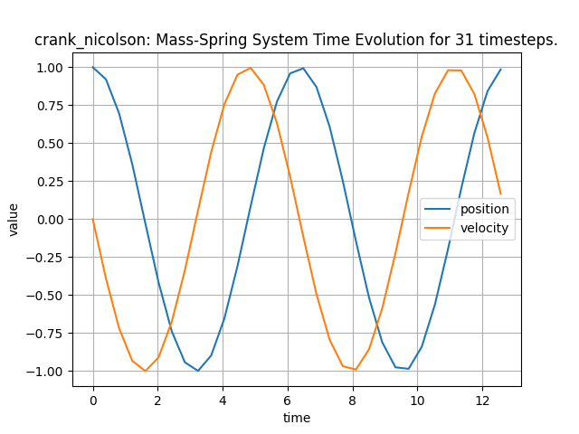
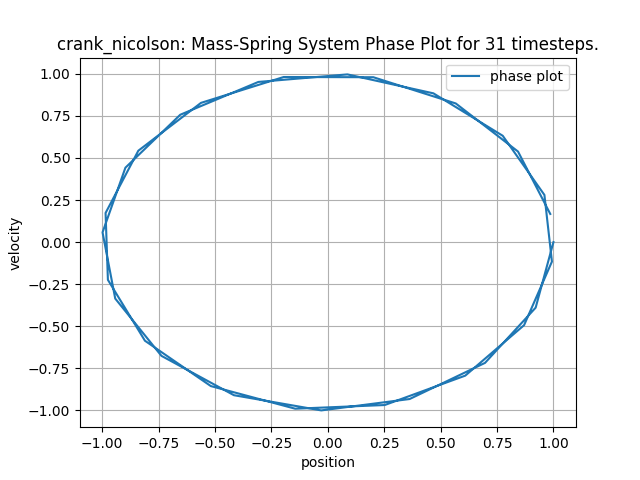

# Report: Numerical Integration of a Mass-Spring System

## 1. Introduction
In this assignment, we analyze different time-stepping methods for solving Ordinary Differential Equations (ODEs). We apply these methods to a simple harmonic oscillator (mass-spring system), which is described by the second-order ODE:

$$ m y''(t) = -k y(t) $$

By introducing the velocity $v(t) = y'(t)$, we rewrite this as a system of first-order ODEs:

$$ \frac{d}{dt} \begin{pmatrix} y_0 \\ y_1 \end{pmatrix} = \begin{pmatrix} y_1 \\ -\frac{k}{m} y_0 \end{pmatrix} $$

We implemented and compared four numerical schemes: **Explicit Euler**, **Implicit Euler**, **Improved Euler**, and **Crank-Nicolson**.

## 2. Implementation
The implementation is based on a C++ `TimeStepper` class hierarchy. The right-hand side of the ODE is encapsulated in a `NonlinearFunction` class (`MassSpring`).
For implicit methods (Implicit Euler and Crank-Nicolson), we solve the resulting non-linear system using a Newton solver, which requires the Jacobian of the function.

The new methods were implemented as follows:
*   **Improved Euler:** An explicit predictor-corrector method (Heun's method).
*   **Crank-Nicolson:** An implicit method averaging the gradient at the current and the next time step.

## 3. Results and Discussion

We simulated the system with $m=1$ and $k=1$. The analytical solution describes a circle in the phase space (conservation of energy). We analyzed the behavior of the methods by varying the number of time steps $N$ (decreasing the step size $\tau$).

### 3.1 Explicit Euler Method
The Explicit Euler method approximates the derivative using the forward difference quotient.

**Stability Analysis with Larger End-Times:**
We tested the method with a fixed number of steps ($N=100$) but increasing end-times $T$ (ranging from $2\pi$ to $20\pi$).

**Observation:**
The Explicit Euler method is **unstable** for this oscillatory system.
*   **Time Plot:** The amplitude of the oscillation grows exponentially over time.
*   **Phase Plot:** The solution spirals outwards, indicating a non-physical increase in energy.

**Convergence:** When increasing the number of time steps (in the standard test case), the "spiraling out" effect becomes slower. The error decreases linearly with $O(\tau)$, meaning the trajectory stays closer to the exact circle for a longer time, but the inherent instability remains for any finite step size.

### 3.2 Implicit Euler Method
The Implicit Euler method uses the backward difference quotient.

**Observation:**
The Implicit Euler is unconditionally stable but exhibits strong **numerical damping**.
*   **Time Plot:** The amplitude decreases visibly over time, as if friction were present.
*   **Phase Plot:** The solution spirals inwards, meaning the system loses energy over time.

**Convergence:** As we increase the number of time steps (e.g., to $N=200$), this damping effect is significantly reduced. The spiral becomes tighter and approaches the exact circle. Like the Explicit Euler, this is a first-order method, so the error reduces linearly with $O(\tau)$ as the step size decreases.

### 3.3 Improved Euler Method
The Improved Euler method (Heun's method) is an explicit predictor-corrector scheme of order 2.

**Observation:**
The Improved Euler method performs significantly better than the standard Euler methods.
*   **Time Plot:** The amplitude appears stable over the simulated timeframe.
*   **Phase Plot:** The trajectory is much closer to a closed circle compared to the Explicit Euler.

**Convergence:** Since this is a second-order method with $O(\tau^2)$, the error decreases quadratically. Increasing the steps from 10 to 100 improves the accuracy by a factor of roughly 100. Even with moderate step sizes, the solution is visually almost indistinguishable from the exact solution.

### 3.4 Crank-Nicolson Method
The Crank-Nicolson method is implicit and corresponds to the trapezoidal rule.

**Observation:**
The Crank-Nicolson method demonstrates the best qualitative behavior.
*   **Time Plot:** The amplitude is perfectly preserved; there is no visible growth or decay.
*   **Phase Plot:** The phase plot shows a **closed loop**, indicating that the method preserves the energy of the system ("energy conservation").

**Convergence:** While the amplitude is preserved even for small numbers of steps (large $\tau$), the *phase accuracy* (the speed of the oscillation along the circle) improves quadratically with $O(\tau^2)$ as we increase the number of steps.

## 4. Conclusion
Our comparison highlights the properties of the different time-stepping schemes:
1.  **Explicit Euler:** Unstable for oscillatory systems; energy grows.
2.  **Implicit Euler:** Stable but introduces heavy numerical damping; energy decays.
3.  **Improved Euler:** More accurate (2nd order) but explicit.
4.  **Crank-Nicolson:** The optimal choice for this mechanical system. It is A-stable and preserves the geometric properties (energy) of the harmonic oscillator.