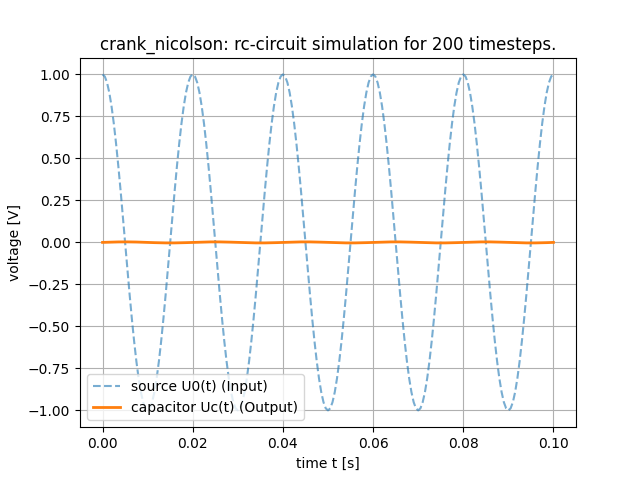
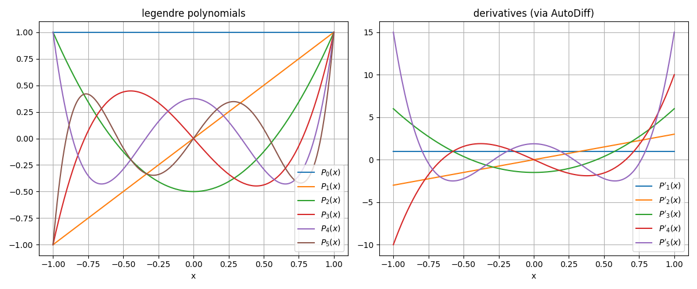
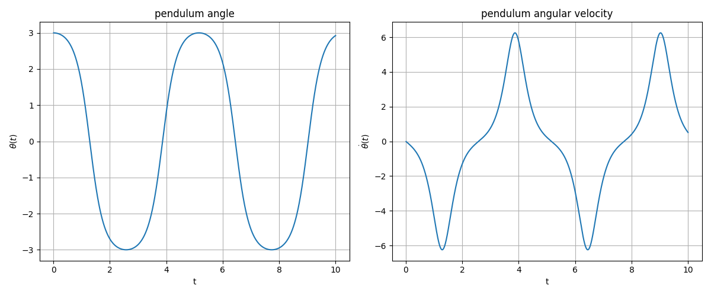
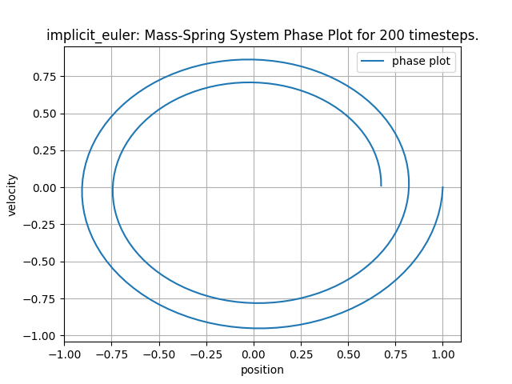
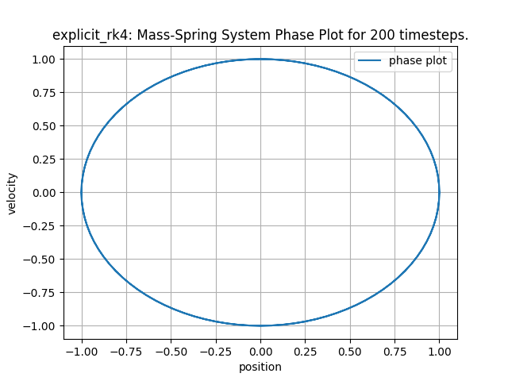
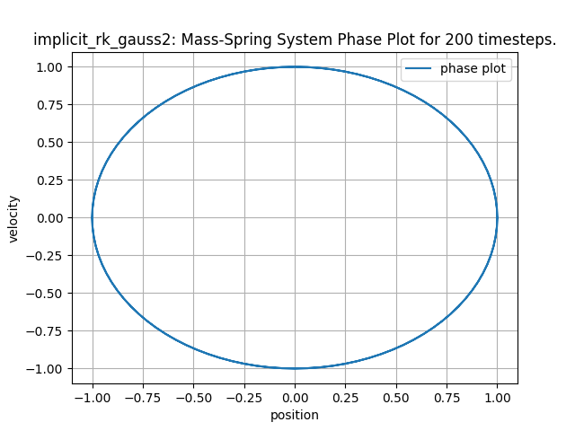

# Report Part 2: Advanced Solvers & AutoDiff

## 1. Simulation of an Electric Circuit (Exercise 17.4)

Following our analysis of the mass-spring system, we applied our time-stepping solvers to an electrical network. The goal was to model a resistor-capacitor (RC) circuit and solve the resulting Ordinary Differential Equation (ODE).

### 1.1 Mathematical Model
The circuit consists of a voltage source $U_0(t)$, a resistor $R$, and a capacitor $C$. According to Kirchhoff's laws and the component equations ($U_R = RI$ and $I = C \dot{U}_C$), the system is described by the ODE:

$$ U_C(t) + RC \frac{dU_C}{dt}(t) = U_0(t) $$

We transformed this into the autonomous form required by our solver interface by introducing time $t$ as a state variable. The source voltage was chosen as a high-frequency oscillating function $U_0(t) = \cos(100\pi t)$.

### 1.2 Implementation and Results
We implemented the class `RCCircuit` to model the right-hand side of the ODE. The primary challenge in this simulation is the high frequency of the driving voltage source ($100\pi \approx 314$). Such systems, where different processes occur on very different time scales, are often referred to as "stiff."

To ensure a stable and accurate solution for this problem, we selected the **Crank-Nicolson method**. As an A-stable, implicit solver, it is exceptionally well-suited for handling oscillatory and potentially stiff ODEs without the restrictive time-step limitations that simpler explicit methods often face.

The simulation results, shown below, demonstrate the expected physical behavior of the RC circuit. The capacitor voltage $U_C(t)$ correctly follows the source voltage $U_0(t)$, but with a characteristic phase shift and amplitude damping. This illustrates the low-pass filtering effect of the resistor-capacitor combination, confirming that our implementation and chosen numerical method accurately capture the dynamics of the system.

*Figure 1: Time evolution of the RC circuit solved with the Crank-Nicolson method. The capacitor voltage accurately tracks the source voltage with the expected physical phase lag and amplitude damping.*

---

## 2. Automatic Differentiation (Exercise 18)

To avoid the error-prone process of manual differentiation for the Jacobian matrix (required by implicit solvers), we implemented an **Automatic Differentiation (AutoDiff)** data type.

### 2.1 The `AutoDiff` Class
We created a template class `AutoDiff<size_t N, typename T>` which stores a value and its gradient (an `std::array<T, N>`). By overloading standard mathematical operators and functions, it automatically applies the chain rule during function evaluation. The template parameter `N` makes the class flexible for problems of different dimensions.

### 2.2 Application: Legendre Polynomials & The Pendulum
We verified our `AutoDiff` implementation by computing Legendre polynomials and their derivatives simultaneously. We then applied it to solve the non-linear pendulum equation with the Crank-Nicolson method, where `AutoDiff` computed the necessary Jacobian for the Newton solver automatically.

| Legendre Polynomials & Derivatives | Pendulum Time Evolution |
| :---: | :---: |
|  |  |

*Figure 2: Applications of Automatic Differentiation. On the left, values and derivatives of Legendre polynomials are computed. On the right, the time evolution of the non-linear pendulum is solved using a Jacobian provided by AutoDiff.*

---

## 3. Runge-Kutta Methods (Exercise 19)

To achieve higher-order accuracy, we implemented a generic **Runge-Kutta (RK)** framework supporting arbitrary Butcher tableaus, including both explicit and implicit methods.

### 3.1 Implementation Details
Our framework includes separate classes for `ExplicitRungeKutta` and the more complex `ImplicitRungeKutta`. The implicit solver uses our function algebra (`MultipleFunc`, `MatVecFunc`) to construct and solve the coupled non-linear system for the intermediate stages via a Newton solver. Furthermore, we implemented dynamic generation of Butcher tableaus for methods like Gauss-Legendre, computing the coefficients from the quadrature nodes.

### 3.2 Results on the Mass-Spring System
We evaluated the performance of our entire suite of implemented solvers using the conservative mass-spring system as a benchmark. The goal was to observe key properties like stability, numerical damping, and long-term energy conservation. The methods can be grouped by their characteristics:

*   **Low-Order Explicit Methods:** The `ImprovedEuler` and `ExplicitRungeKutta` (with a 2-stage RK2 tableau) are second-order methods. They offer a significant improvement over the basic Explicit Euler but still exhibit energy drift over long simulations.

*   **High-Order Explicit Methods:** The classical 4th-order Runge-Kutta method (`ExplicitRungeKutta` with RK4 tableau) is a widely-used "workhorse" solver. It is highly accurate for short-to-medium term simulations, as shown in the visual comparison.

*   **High-Order Implicit Methods:** This category showcases the most specialized behaviors. The **Gauss-Legendre** methods (`implicit_rk_gauss2`, `implicit_rk_gauss3`) are symplectic, making them theoretically ideal for conserving energy in mechanical systems. The **Radau IIA** methods (`implicit_rk_radau`), in contrast, are L-stable. They are designed for stiff problems and introduce numerical damping, which would cause an inward spiral in this specific case.

The following gallery provides a visual summary of these distinct behaviors, from the clear failure of first-order methods to the high fidelity of 4th-order schemes. For a detailed comparison of all implemented solvers, the complete set of generated plots in the `demos/mass_spring` directory can be consulted.

| Explicit Euler (Energy Gain) | Implicit Euler (Energy Loss) |
| :---: | :---: |
|  |  |
| **Classical RK4 (Improved)** | **Gauss-Legendre (Symplectic)** |
|  |  |

*Figure 3: A visual comparison of phase space trajectories for the mass-spring system. The first-order Euler methods (top row) clearly fail, showing energy gain (outward spiral) or loss (inward spiral). In contrast, the 4th-order classical RK4 method (bottom-left) is highly accurate, producing a visually perfect closed orbit for this simulation duration. The symplectic Gauss-Legendre method (bottom-right) also produces a perfect orbit, with the theoretical advantage of guaranteed energy conservation for arbitrarily long simulations.*